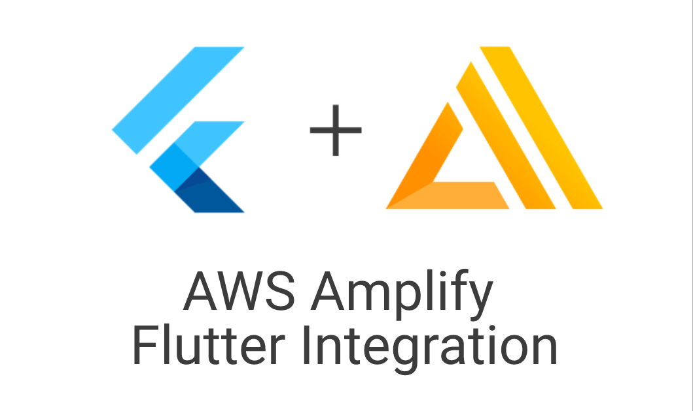
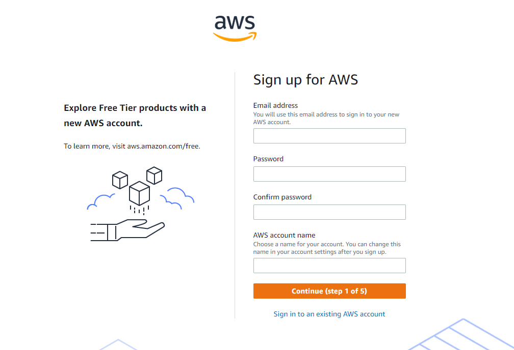
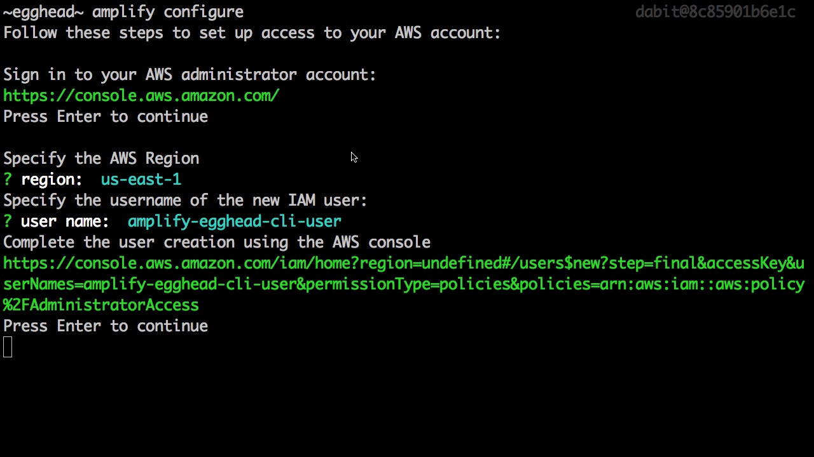
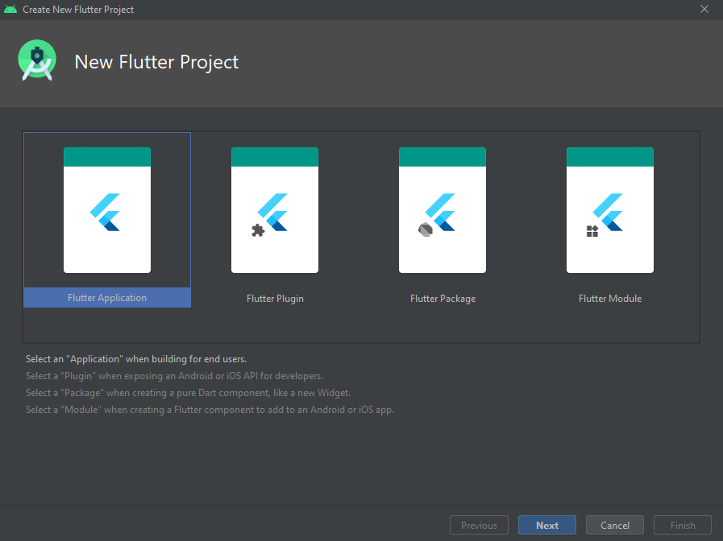
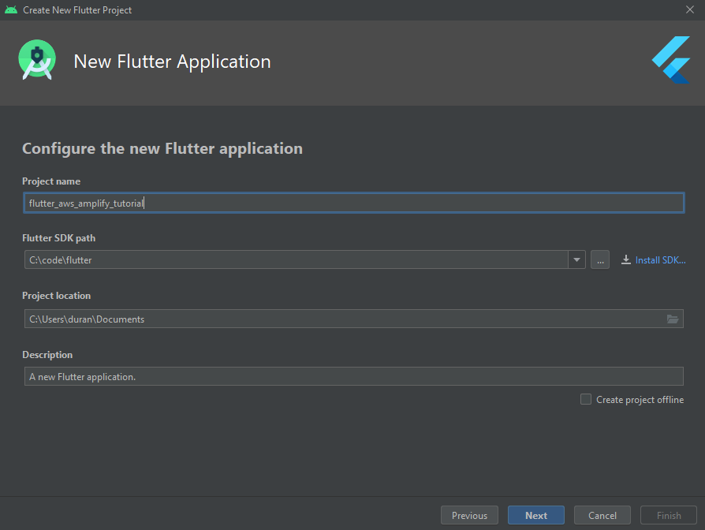
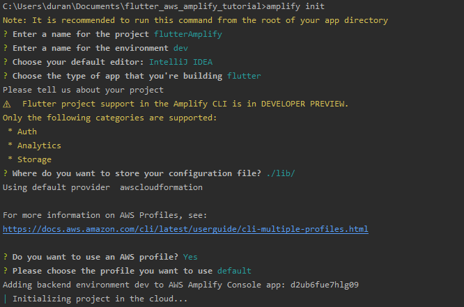
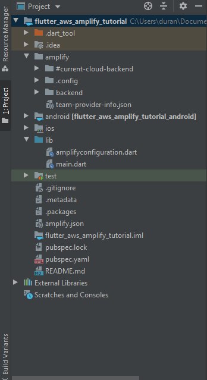
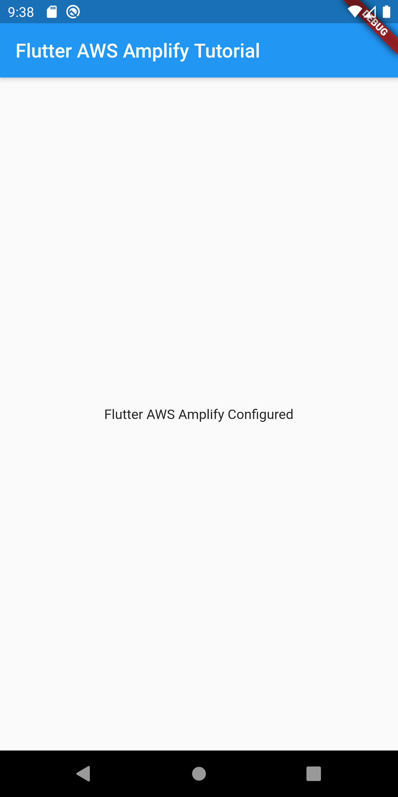

# AWS Amplify Flutter Integration

[](https://lbesson.mit-license.org/) [](https://twitter.com/flutterist)




Amazon Web Services **(AWS)** as a whole is stacked. They have so many different services that it really is an all-in-one solution.

**AWS Amplify** is a set of tools and services that can be used together or on their own, to help front-end web and mobile developers build scalable full stack applications, powered by AWS. With Amplify, you can configure app backends and connect your app in minutes, deploy static web apps in a few clicks, and easily manage app content outside the AWS console.

We can build with AWS Amplify;

- **Authentication** — Create user authentication experiences with Amazon Cognito
- **Analytics** — Collect analytics data with Amazon Pinpoint
- **Storage** — Store user content with Amazon S3

With this tutorial, **we will integrate the AWS Amplify to our Flutter project from zero**.

#### Tutorial Sections
- [Create AWS account](#create-aws-account)
- [Prerequisites](#prerequisites)
- [Create Flutter App](#create-flutter-app)
- [Initialize Amplify Project](#init-amplify-project)


### <a name="create-aws-account"></a>Create AWS account

- Open the [Amazon Web Services home page](https://aws.amazon.com/).
- Choose **Create an AWS Account**.
- Enter your account information, and then choose Continue. Be sure that you enter your account information correctly, especially your email address. If you enter your email address incorrectly, you can't access your account.
- Choose Personal or Professional.
- Enter your company or personal information.
- Read and accept the AWS Customer Agreement.
Note: Be sure that you read and understand the terms of the AWS Customer Agreement.
- Choose **Create Account and Continue**.



> Note: After you add your payment method and verify your phone number, a confirmation page indicates that your account is being activated. Accounts are usually activated within a few minutes, but the process might take up to 24 hours. When your account is fully activated, you receive a confirmation email.


### <a name="prerequisites"></a>Prerequisites

- [Install Flutter](https://flutter.dev/docs/get-started/install) version 1.20.0 or higher
- [Setup your IDE](https://flutter.dev/docs/get-started/editor?tab=androidstudio). This tutorial assumes you are using AndroidStudio to develop your app.
- [ Install the Amplify CLI](https://docs.amplify.aws/cli) by running:

```
npm install -g @aws-amplify/cli@flutter-preview
```
> Note: Because we’re installing the Amplify CLI globally, you might need to run the command above with sudo depending on your system policies.



After install the CLI, configure Amplify by running the following command:

```
amplify configure
```
`amplify configure` will ask you to sign into the AWS Console.

Once you’re signed in, Amplify CLI will ask you to create an IAM user.

> Amazon IAM (Identity and Access Management) enables you to manage users and user permissions in AWS. You can learn more about Amazon IAM [here](https://aws.amazon.com/iam/).

```
Specify the AWS Region
? region:  # Your preferred region
Specify the username of the new IAM user:
? user name:  # User name for Amplify IAM user
Complete the user creation using the AWS console
```

Create a user with ``AdministratorAccess`` to your account to provision AWS resources for you like AppSync, Cognito etc.


Once the user is created, Amplify CLI will ask you to provide the ``accessKeyId`` and the ``secretAccessKey`` to connect Amplify CLI with your newly created IAM user.

  
```
Enter the access key of the newly created user:
? accessKeyId:  # YOUR_ACCESS_KEY_ID
? secretAccessKey:  # YOUR_SECRET_ACCESS_KEY
This would update/create the AWS Profile in your local machine
? Profile Name:  # (default)

Successfully set up the new user.
```
Keep ``accessKeyId`` and ``secretAccessKey``, we will use them in our project.

### <a name="create-flutter-apps"></a>Create Flutter App

Follow the [Set up an editor](https://flutter.dev/docs/get-started/editor?tab=androidstudio) instructions to install the Dart and Flutter plugins.





To create a new Flutter project from the Flutter starter app template:

- In the IDE, click **Create New Project** from the Welcome window or **File > New > Project** from the main IDE window.
- Select **Flutter** in the menu, and click Next.
- Enter your desired **Project name** and **Project location**.
- If you might publish this app, set the company domain.
- Click Finish.

### <a name="init-amplify-project"></a>Initialize Amplify Project

To create an Amplify project, you must initialize and configure the project at the root directory of your project. Now we can open terminal from Android Studio. Then initialize your project Amplify project:

```
amplify init
```

You should now be prompted with several questions on how to configure your project. If you press the Enter key for each question, it will give the default answer to each question, resulting in an output that should look similar to this:

```
C:\Users\duran\Documents\flutter_aws_amplify_tutorial>amplify init
Note: It is recommended to run this command from the root of your app directory
? Enter a name for the project flutterAmplify
? Enter a name for the environment dev
? Choose your default editor: IntelliJ IDEA
? Choose the type of app that you're building flutter
Please tell us about your project
⚠️  Flutter project support in the Amplify CLI is in DEVELOPER PREVIEW.
Only the following categories are supported:
 * Auth
 * Analytics
 * Storage
? Where do you want to store your configuration file? ./lib/
Using default provider  awscloudformation

For more information on AWS Profiles, see:
https://docs.aws.amazon.com/cli/latest/userguide/cli-multiple-profiles.html

? Do you want to use an AWS profile? Yes

? Please choose the profile you want to use default
Adding backend environment dev to AWS Amplify Console app:

| Initializing project in the cloud...

```

After the CLI has finished crating your project in the cloud, you should get an output like this:



```
√ Successfully created initial AWS cloud resources for deployments.
√ Initialized provider successfully.
Initialized your environment successfully.

Your project has been successfully initialized and connected to the cloud!
```

You should see create a new file **amplify.json** and **amplify** folder have been added to your project. Also under the *lib* folder, you will see a new file **amplifyconfiguration.dart** has been added.

- **lib/amplifyconfiguration.dart**: This is a static file you can import that holds all your public facing Amplify data.

- **amplify/backend**: contains lots of metadata about your cloud instance, we dont need to edit this folder.




#### Install the Dependency 

We need to install **amplify_flutter** package. ```amplify_flutter``` is a core package containing base types, utilities shared across the amplify-flutter library.

In your **pubspec.yaml** add under *dependencies*:
```
  amplify_flutter: ^0.1.0
```
> For the latest version check pub.dev [amplify_flutter](https://pub.dev/packages/amplify_flutter) page.

Here is the sample code for **main.dart** to configure AWS Amplify

```
import 'package:amplify_flutter/amplify.dart';
import 'package:flutter/material.dart';
import 'package:flutter_aws_amplify_tutorial/amplifyconfiguration.dart';

void main() {
  runApp(MaterialApp(
    home: MyApp(),
    routes: {},
  ));
}

class MyApp extends StatefulWidget {
  @override
  _MyAppState createState() => _MyAppState();
}

class _MyAppState extends State<MyApp> {
  // Is AWS Amplify configured
  bool _amplifyConfigured = false;

  @override
  void initState() {
    super.initState();

    // run configure method initial
    _configureAmplify();
  }

  void _configureAmplify() async {
    if (!mounted) return;

    //aws amplify configuration
    await Amplify.configure(amplifyconfig);
    try {
      setState(() {
        _amplifyConfigured = true;
      });
    } catch (e) {
      print(e);
    }
  }

  @override
  Widget build(BuildContext context) {
    return MaterialApp(
        home: Scaffold(
          appBar: AppBar(
            title: const Text('Flutter AWS Amplify Tutorial'),
      ),
          body: Center(
              child: Text(_amplifyConfigured
              ? "Flutter AWS Amplify Configured"
              : "Flutter AWS Amplify Not Configured")),
    ));
  }
}

```


> If you get error ```uses-sdk:minSdkVersion 16 cannot be smaller than version 21 declared in library```, you need to edit the **build.gradle** file located inside your project directory like **your_project_folder\android\app\build.gradle** and find and edit this line ``minSdkVersion 16`` to ``minSdkVersion 23`` then save the file use flutter clean command and run it.

If you completed all steps and run it succesfully, you have to see the screen below:



### License
[MIT](https://github.com/durannumit/aws_amplify_flutter_integration)


> Note : amplfiy folder deleted beacuse it contains account informations. You need to configure your own AWS account to run the app

> Flutter AWS Auth, Storage and Analytics coming soon!